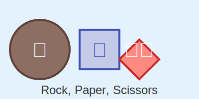

# Rock, Paper, Scissors Game 🪨📄✂️
---
[In C Script](https://github.com/mdriyadkhan585/rock-paper-scissors-C)



---
Welcome to the Python version of the Rock, Paper, Scissors game! This command-line game allows you to challenge the computer in a classic game of Rock, Paper, Scissors. Play to see who wins!

## Table of Contents 📚

1. [Introduction](#introduction)
2. [Features](#features)
3. [How to Run](#how-to-run)
4. [Gameplay Instructions](#gameplay-instructions)
5. [Code Explanation](#code-explanation)


## Introduction

This project is a straightforward implementation of the Rock, Paper, Scissors game in Python. It demonstrates basic concepts like user input handling, random choice generation, and simple game logic.

## Features 🌟

- Play Rock, Paper, Scissors against the computer 🤖
- Clear and informative output 💬
- Randomized computer choices 🎲
- Easy to run and understand code 🧩

## How to Run 🚀

1. **Clone the Repository:**
   ```bash
   git clone https://github.com/mdriyadkhan585/rock-paper-scissors-python.git
   ```

2. **Navigate to the Project Directory:**
   ```bash
   cd rock-paper-scissors-python
   ```

3. **Run the Program:**
   Make sure you have Python installed, then execute:
   ```bash
   python rock_paper_scissors.py
   ```

## Gameplay Instructions 🎮

1. **Start the Game:**
   After running the program, you’ll be prompted to enter your choice.

2. **Enter Your Choice:**
   - Type `Rock` 🪨
   - Type `Paper` 📄
   - Type `Scissors` ✂️

3. **View the Results:**
   The program will display the computer's choice and the result of the game (win, lose, or tie).

4. **Play Again:**
   You can run the program again to play another round.

## Code Explanation 🛠️

1. **Getting the Computer's Choice:**
   ```python
   def get_computer_choice():
       return random.choice(['Rock', 'Paper', 'Scissors'])
   ```
   - Uses the `random.choice` function to select a random choice for the computer.

2. **Determining the Winner:**
   ```python
   def determine_winner(player_choice, computer_choice):
       # Compares choices and prints the result
   ```
   - Compares player and computer choices and prints whether the player won, lost, or tied.

3. **User Input and Validation:**
   ```python
   player_choice = input("Your choice: ").capitalize()
   ```
   - Prompts the user to enter their choice and capitalizes the input to match the expected format.

4. **Formatted Output:**
   - Displays user and computer choices, and announces the result in a clear and engaging format.

---
